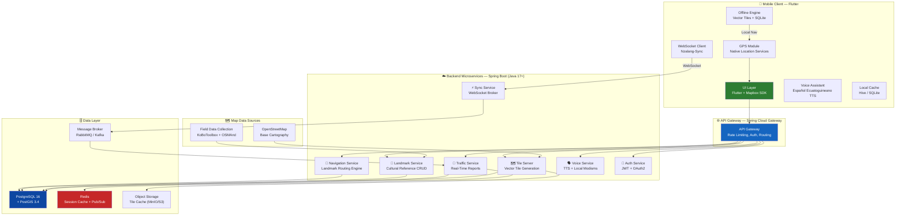
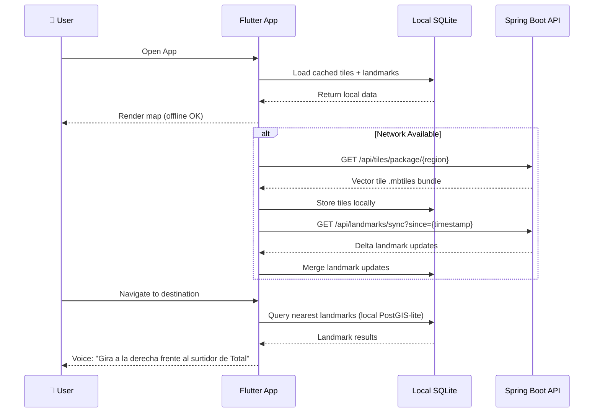
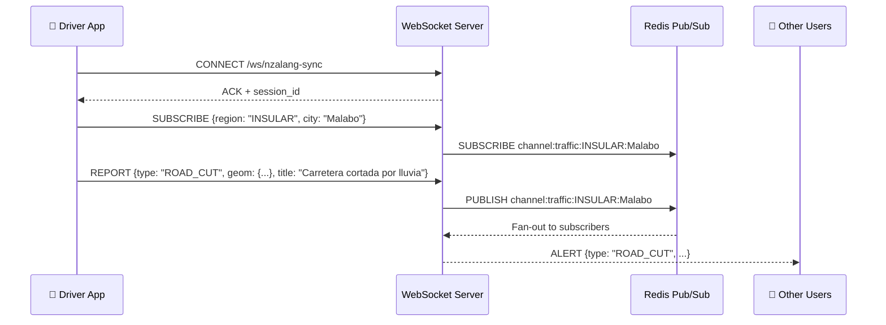

# INTELIJGPS — System Architecture

> **INTELIJGPS** — *Navegación Inteligente para Guinea Ecuatorial*
> Landmark-based, offline-first navigation tailored to the geographic and cultural context of Equatorial Guinea.

---

## 1. High-Level Architecture



---

## 2. Communication Protocols

| Flow | Protocol | Description |
|------|----------|-------------|
| **Mobile ↔ API Gateway** | HTTPS / REST | All CRUD ops, route requests, tile downloads |
| **Mobile ↔ Sync Service** | WSS (WebSocket Secure) | Real-time traffic alerts (Nzalang-Sync) |
| **Traffic Service ↔ Redis** | Pub/Sub | Fan-out traffic events to all connected clients |
| **Tile Server ↔ Object Storage** | S3 API | Pre-rendered vector tile retrieval |
| **Navigation Service ↔ PostGIS** | SQL + Spatial Queries | `ST_DWithin`, `ST_Distance`, pgRouting |
| **Field Collection → Landmark Service** | REST Batch Import | Bulk POI ingestion from KoBoToolbox exports |

---

## 3. Microservice Responsibilities

### 🧭 Navigation Service
- Receives user GPS coordinates + heading
- Queries PostGIS for nearest landmarks using `ST_DWithin`
- Computes relative spatial relationship (ahead, behind, left, right)
- Returns culturally-aware navigation instruction
- Supports pgRouting for turn-by-turn directions

### 📍 Landmark Service
- Full CRUD for cultural landmarks (Hitos Culturales)
- Fuzzy name search via `pg_trgm` trigram index
- Alias resolution (multiple names per landmark)
- Community submission queue with admin moderation
- Batch import from KoBoToolbox field surveys

### 🚦 Traffic Service
- Stores and queries real-time traffic reports
- Confidence scoring based on community upvotes/downvotes
- Automatic report expiration (`expires_at`)
- Spatial query for reports along a route corridor

### 🗺️ Tile Server
- Generates and serves Mapbox Vector Tiles (MVT)
- Pre-packages regional tile bundles (`.mbtiles`) for offline download
- Incremental tile updates triggered by landmark database changes

### ⚡ Sync Service (Nzalang-Sync)
- WebSocket server for real-time bidirectional communication
- Channel-based subscriptions (region + city)
- Redis Pub/Sub backend for horizontal scaling
- Heartbeat and automatic reconnection handling

### 🗣️ Voice Service
- Text-to-Speech with Español Ecuatoguineano locale
- Curated modism dictionary for natural-sounding instructions
- Fallback to standard Spanish TTS

### 🔐 Auth Service
- JWT-based stateless authentication
- OAuth2 social login (Google, Facebook)
- Anonymous mode for basic navigation (no account required)

---

## 4. Offline-First Architecture



### Tile Package Sizes (Estimated)

| Package | Zoom Levels | Size |
|---------|------------|------|
| Malabo Centro | Z10–Z16 | ~45 MB |
| Bata Centro | Z10–Z16 | ~35 MB |
| Carretera Nacional N1 | Z10–Z14 | ~80 MB |
| Full Country Pack | Z10–Z16 | ~250 MB |

### Sync Strategy
- **Delta sync**: Client sends `last_sync_timestamp`, server returns only changes since then
- **Conflict resolution**: Server-wins strategy for landmarks; client-wins for user preferences
- **Background sync**: Android WorkManager / iOS BGTaskScheduler for periodic updates

---

## 5. Nzalang-Sync — WebSocket Protocol



### Message Types

| Type | Direction | Description |
|------|-----------|-------------|
| `CONNECT_ACK` | Server → Client | Connection confirmed with session ID |
| `SUBSCRIBE` | Client → Server | Subscribe to traffic channel (region + city) |
| `UNSUBSCRIBE` | Client → Server | Unsubscribe from channel |
| `TRAFFIC_REPORT` | Client → Server | Submit new traffic report |
| `TRAFFIC_ALERT` | Server → Client | Broadcast traffic event to subscribers |
| `HEARTBEAT` | Bidirectional | Keep-alive ping/pong every 30s |

### Message Schema

```json
{
  "type": "TRAFFIC_REPORT",
  "payload": {
    "report_type": "ROAD_CUT",
    "severity": 4,
    "title": "Carretera cortada por lluvia en Rebola",
    "geom": {
      "type": "Point",
      "coordinates": [8.75, 3.72]
    },
    "road_name": "Carretera de Rebola",
    "city": "Malabo",
    "region": "INSULAR",
    "expires_at": "2026-03-09T18:00:00Z"
  },
  "timestamp": "2026-03-09T12:05:00Z",
  "sender_id": "anon-sha256-hash"
}
```

---

## 6. Technology Stack Summary

| Layer | Technology | Version | Purpose |
|-------|-----------|---------|---------|
| Mobile | Flutter | 3.x | Cross-platform (Android + iOS) |
| Maps SDK | Mapbox GL | Latest | Vector map rendering + offline |
| Backend | Java | 17+ | Microservice logic |
| Framework | Spring Boot | 3.x | REST APIs, WebSocket, Security |
| Gateway | Spring Cloud Gateway | 4.x | API routing, rate limiting |
| Database | PostgreSQL | 16 | Primary data store |
| Geo Extension | PostGIS | 3.4 | Spatial queries, geometry |
| Routing | pgRouting | 3.x | Graph-based path finding |
| Cache | Redis | 7.x | Session cache, Pub/Sub |
| Message Broker | RabbitMQ | 3.x | Async event processing |
| Object Storage | MinIO / AWS S3 | — | Tile bundles, media |
| Field Survey | KoBoToolbox | — | Data collection forms |
| Map Data | OpenStreetMap | — | Base cartography |

---

## 7. Security Architecture

- **Transport**: TLS 1.3 for all HTTP and WebSocket connections
- **Authentication**: JWT tokens with 15-min access + 7-day refresh rotation
- **Authorization**: Role-based (ANONYMOUS, USER, CONTRIBUTOR, MODERATOR, ADMIN)
- **Data Privacy**: GPS coordinates are never stored with user identity; anonymous hashing for traffic reports
- **API Rate Limiting**: 100 req/min for authenticated, 20 req/min for anonymous
- **Input Validation**: All GeoJSON validated against RFC 7946 before PostGIS insertion
