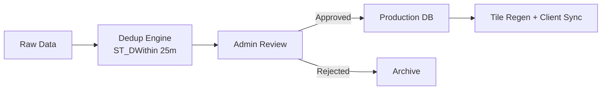
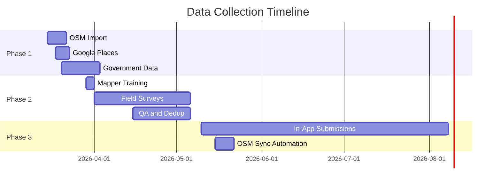

# INTELIJGPS — Data Collection Strategy

> Efficiently building the landmark database for Malabo and Bata

**Target**: 5,000+ verified landmarks across Malabo and Bata within 8 weeks.

---

## Phase 1: Seed from Existing Sources (Weeks 1–3)

### OpenStreetMap (Primary)

**Tool**: Overpass API query for all amenities in GQ bounding box.

```
[out:json][timeout:120];
area["ISO3166-1"="GQ"]->.eq;
(
  node["amenity"](area.eq);
  node["shop"](area.eq);
  node["tourism"](area.eq);
  way["amenity"](area.eq);
);
out center body;
```

Expected: ~2,000 POIs. Import via batch REST API, mark as `verified=FALSE, source='osm_import'`.

### Google Places API (Supplement)

Query gas stations, hospitals, churches, schools, markets in Malabo and Bata within 5km radius. Expected: ~500 additional POIs.

### Government Data

- Ministry of Transport: road network, toll locations
- INE: census boundaries, district names
- CEIBA Airlines: airport facilities

---

## Phase 2: Community Field Survey (Weeks 3–8)

### Team: 10 field mappers (5 Malabo, 5 Bata), 1 coordinator

### Tools
| Tool | Purpose | Cost |
|------|---------|------|
| KoBoToolbox | GPS survey forms | Free |
| OSMAnd | Offline map reference | Free |
| Budget smartphones (×10) | GPS + camera | $1,000 total |

### Survey Form
Key fields: name, aliases, category, GPS (auto), photo, district, and crucially:
> *"¿Cómo le dirías a un taxista que te lleve aquí?"* → captures natural nav phrases

### Priority Zones

**Malabo**: Centro, Ela Nguema, Caracolas, Sipopo, Aeropuerto, Carretera Rebola→Luba

**Bata**: Centro, Ela Nguema, Comandachina, N1 (→Ebebiyín), N2 (→Mbini)

### Expected Output: 3,000–5,000 POIs, 80%+ with cultural nav phrases, 90%+ with photos

---

## Phase 3: Crowdsource & Maintain (Ongoing)

### In-App Submissions
"Add Landmark" button → admin review queue → auto-promote on approval

### Gamification (Nzalang Points)
| Action | Points |
|--------|--------|
| Landmark approved | +10 |
| Traffic report verified | +5 |
| District survey complete | +50 |

Tiers: Explorador → Navegante → Capitán → Nzalang de Oro

### Weekly OSM Sync
Cron job queries Overpass for changes, deduplicates via `ST_DWithin(25m)`, auto-approves high-confidence entries.

---

## Data Quality Pipeline



### Quality Score (0–100)
`score = has_name(20) + has_photo(15) + has_nav_phrase(25) + has_category(10) + has_district(10) + field_verified(20)`

Landmarks with `score < 45` are shown on map but excluded from voice navigation.

---

## Budget: ~$4,700

| Item | Cost |
|------|------|
| Smartphones (10×) | $1,000 |
| Mobile data | $200 |
| Mapper stipends (5 weeks) | $2,500 |
| Data coordinator (8 weeks) | $800 |
| Google Places API | $200 |

---

## Timeline


